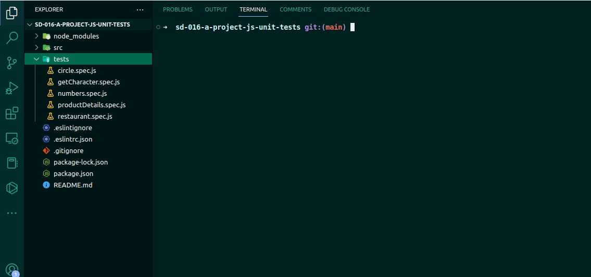

# JS Unit Tests

Sexto projeto desenvolvido no módulo de Fundamentos do Curso de Desenvolvimento Web da Trybe.

O projeto consistia em escrever testes unitários para funções utilizando Jest para verificar o correto funcionamento dessas funções, utilizando uma abordagem de desenvolvimento orientado a testes.

## 🚀 Tecnologia

- ⚡ JavaScript é uma linguagem de programação interpretada estruturada, de script em alto nível com tipagem dinâmica fraca e multiparadigma.

- ⚡ Jest é um framework de teste unitário de código aberto em JavaScript criado pelo Facebook a partir do framework Jasmine.

## ✋🏻 Pré-requisitos

- [git](https://git-scm.com/downloads): Ferramenta para gerenciar o código-fonte

- [Visual Studio Code](https://code.visualstudio.com/): Editor de Código Fonte

## :hammer_and_wrench: Antes de iniciar o projeto.

No diretório do projeto, instale as dependências e inicialize o projeto:

### `npm install`

Instala as dependências.

### `npm test`

Executa todos os testes presentes na aplicação.
